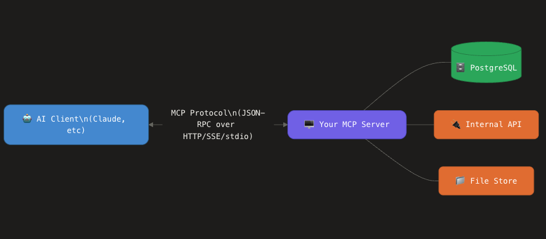

# mcp-server
How to build MCP server for your internal data

what is MCP?
MCP is a model context protocol that defines how your AI applications(ChatGPt, Claude, Gemini) connect to
external tools and data. eg: your local database, apis, file systems

MCP is an open protocol (created by Anthropic) that standardizes how AI assistants discover and invoke external tools.
Think of it as USB port for AI.
one standard interface that lets any AI model connect to any data source.

The MCP server sits between your AI client and your internal systems. It handles:

**Tool discovery:** Tells the AI what operations are available

**Parameter validation:** Ensures the AI sends correct inputs

**Data access:** Queries your internal systems

**Response formatting:** Returns structured data the AI can reason about

**Authentication:** Verifies who's making the request

Resource: https://www.freecodecamp.org/news/how-to-build-mcp-servers-for-your-internal-data/

**Core MCP Concepts**
MCP servers can provide three main types of capabilities:

**Resources**: File-like data that can be read by clients (like API responses or file contents)

**Tools**: Functions that can be called by the LLM (with user approval)

**Prompts**: Pre-written templates that help users accomplish specific tasks

**Documentation**: https://modelcontextprotocol.io/docs/develop/build-server